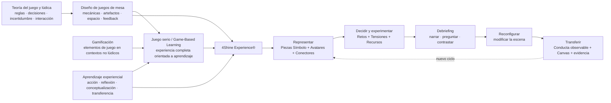

# Investigación académica para el diseño de 4Shine Experience®: juego, lúdica, gamificación y aprendizaje con juegos de mesa

## Resumen ejecutivo

La revisión de literatura abierta conduce a una conclusión importante para 4Shine Experience®: **la metodología no debería definirse simplemente como “gamificación” ni como “juego de mesa”**. Lo que estamos diseñando se aproxima más a un **sistema de aprendizaje experiencial facilitado, basado en juego serio de mesa, construcción simbólica, decisiones, interacción social, debriefing y transferencia conductual**. La gamificación puede aportar algunos principios —reto, progresión, feedback, autonomía, narrativa, incertidumbre—, pero no debería constituir el núcleo de la experiencia. La definición académica clásica de gamificación se refiere al uso de elementos de diseño de juegos en contextos que no son juegos; 4Shine, en cambio, está construyendo una experiencia lúdica completa en la que existen artefactos, reglas de interacción, situaciones, decisiones y transformación de una representación. citeturn3search6turn27view2

La evidencia revisada respalda especialmente cinco decisiones que ya venimos tomando. Primero, el **tablero individual** es conveniente porque preserva agencia, autoría y reflexión personal; después puede migrarse a escenas compartidas. Segundo, las **Piezas Símbolo 4Shine®** tienen más sentido que objetos puramente abstractos cuando la prioridad es reducir la carga de interpretación inicial sin eliminar la metáfora. Tercero, las cartas no deberían operar principalmente como recompensas o azar, sino como **disparadores de reto, perturbación, decisión, perspectiva y conducta observable**. Cuarto, el aprendizaje no termina al “jugar”: el **debriefing guiado es una parte estructural de la intervención**. Quinto, el Canvas de Acción y el seguimiento posterior son indispensables para distinguir una experiencia entretenida de una intervención de desarrollo. Estas conclusiones son coherentes tanto con los marcos de diseño de juegos serios como con las revisiones sobre aprendizaje basado en juegos. citeturn20view2turn20view3turn26view5

La literatura específicamente centrada en adolescentes y juegos de mesa es especialmente prometedora. Una revisión sistemática de 2024 encontró que, entre las intervenciones analizadas, la socialización aparecía en el 100 %, la cooperación en el 89 %, la motivación en el 79 %, y la toma de decisiones y la comunicación en el 68 %. Esto no significa que un juego produzca automáticamente esas competencias, pero sí identifica mecanismos especialmente compatibles con los objetivos de 4Shine School Lab. citeturn27view6turn27view7

Al mismo tiempo, la literatura obliga a evitar un error frecuente: **“más juego” no significa automáticamente “más aprendizaje”**. Las revisiones críticas señalan estudios breves, heterogeneidad conceptual, dependencia del contexto y diseños de investigación débiles en parte de la literatura de gamificación. La meta-análisis de Sailer y Homner sí encuentra efectos positivos de la gamificación sobre resultados cognitivos, motivacionales y conductuales, pero la arquitectura de la experiencia importa: no existe una mecánica universal que funcione independientemente del participante, el objetivo o el entorno. citeturn27view0turn27view2

El estudio piloto de Cardinali, Guasco, Boero y Olcese publicado en 2026 es particularmente aleccionador para 4Shine School Lab. Trabajó con estudiantes adolescentes mediante juegos de mesa y **debriefing guiado**. Los resultados cuantitativos inmediatos fueron mixtos y no demostraron una mejora robusta atribuible a la intervención, mientras que los datos cualitativos mostraron reflexión sobre riesgo, pensamiento crítico y conciencia emocional. Los autores recomiendan muestras mayores, seguimiento longitudinal y combinación de medidas cuantitativas y cualitativas. Esa es prácticamente una hoja de ruta para la validación de 4Shine: medir no solamente satisfacción inmediata, sino comprensión, conducta, transferencia y sostenimiento. citeturn26view2

En materia ética, trabajar con adolescentes exige convertir la seguridad en una capa de diseño de la metodología. ERIC —iniciativa surgida de la colaboración entre Southern Cross University y UNICEF Office of Research— establece que los derechos, dignidad y bienestar de niños y jóvenes deben primar; distingue consentimiento parental y consentimiento/asentimiento del menor, exige respetar el desistimiento y propone evaluar daños, beneficios, privacidad y confidencialidad de forma continua. BERA añade atención explícita a desigualdades de poder, derecho a retirarse, daño derivado de la investigación y almacenamiento de datos. citeturn28view0turn28view1turn28view2turn28view3

La recomendación estratégica derivada de la investigación es, por tanto:

> **4Shine Experience® no debería intentar ser “un juego que enseña liderazgo”. Debe ser una metodología facilitada que usa un sistema físico-digital de representación, decisión, perturbación, conversación, reconfiguración y transferencia para hacer visible cómo una persona actúa y cómo puede actuar de otra manera.**

Para School Lab, esto puede traducirse en un ciclo propietario sencillo:

**Construyo → Narro → Exploro → Reconfiguro → Actúo → Evidencio.**

Ese ciclo puede convertirse en uno de los componentes más diferenciadores y defendibles de la metodología.

## Mapa conceptual y corpus de investigación

### Cómo se relacionan los campos

Conviene distinguir cuatro tradiciones. La **teoría/diseño del juego** estudia sistemas de reglas, decisiones, incertidumbre, interacción y experiencia. La **gamificación** toma determinados elementos de esos sistemas y los introduce en contextos que no son juegos. El **aprendizaje basado en juegos y los serious games** utilizan una experiencia de juego completa con finalidad formativa. Finalmente, el **aprendizaje experiencial** explica por qué vivir una experiencia no basta: es necesaria reflexión, conceptualización y transferencia. MDA, por ejemplo, separa mecánicas, dinámicas y experiencia estética, mientras que *The Art of Serious Game Design* distingue aprendizaje, storytelling, gameplay y experiencia del usuario y recalca que el diseñador controla directamente el diseño, no la experiencia final del jugador. citeturn8search1turn20view3

Esto tiene una implicación terminológica. Desde una perspectiva académica, 4Shine School Lab estaría mejor descrito como **facilitated serious tabletop learning** o **metodología de aprendizaje experiencial mediada por juego serio y artefactos**, dejando “gamificación” como una de sus fuentes de diseño y no como su definición principal. Esta es una inferencia de diseño a partir de las distinciones entre gamificación, juegos y game-based learning presentes en la literatura. citeturn3search6turn26view4turn19search27

### Composición del corpus curado

El siguiente corpus no pretende ser una revisión sistemática PRISMA exhaustiva; es una **selección analítica orientada al diseño de 4Shine**, priorizando editoriales OA, repositorios institucionales, Pressbooks/OER, SciELO, revistas universitarias, PMC, Frontiers, Springer Open Access, OAPEN, MIT OpenCourseWare y recursos institucionales sobre ética.

[Descargar gráfico de distribución por idioma](sandbox:/mnt/data/4shine_corpus_idioma.png)

De los 30 recursos seleccionados, 22 están principalmente en inglés, 6 en español y 2 son recursos multilingües que incluyen versión o herramientas en español. La menor disponibilidad de literatura especializada en español es particularmente visible cuando se restringe la búsqueda a **diseño de juegos de mesa + evaluación empírica + adolescentes**; por eso los estudios en español de Chile, España, Costa Rica y Colombia tienen especial valor para 4Shine. citeturn27view6turn15search0turn13search0turn18search26

[Descargar gráfico de distribución por tipo de recurso](sandbox:/mnt/data/4shine_corpus_tipo.png)

La composición por tipo es deliberada: 11 revisiones/meta-análisis, 6 manuales o toolkits, 5 trabajos teóricos/taxonómicos, 4 libros/textos abiertos y 4 estudios o trabajos de diseño empírico. Esto permite evitar dos sesgos: diseñar únicamente desde teoría abstracta o, en el extremo contrario, copiar mecánicas prácticas sin una teoría de aprendizaje detrás.

## Recursos académicos y manuales de acceso abierto

### Convención de acceso

En la columna “OA/licencia” empleo tres niveles:

**✅ OA/OER verificado:** se identificó explícitamente una licencia abierta, por ejemplo CC BY, CC BY-SA o CC BY-NC-SA.

**◐ Acceso abierto/gratuito con licencia incompleta o ambigua:** el texto puede leerse legalmente en revista o repositorio, pero la licencia de reutilización no quedó inequívocamente identificada en los metadatos recuperados.

**⚠ Acceso gratuito, no OA estricto:** existe una copia legal alojada por autor/universidad o un manuscrito Green OA, pero no debe suponerse permiso para adaptar o reutilizar el contenido.

Las diferencias importan para 4Shine: **poder leer un recurso gratuitamente no equivale necesariamente a poder copiar sus gráficos, plantillas o textos dentro de un producto comercial.**

| Recurso | Autor(es), año | Tipo | Idioma | Enlace directo | OA / licencia | Relevancia para 4Shine Experience® |
|---|---|---|---|---|---|---|
| **The Art of Serious Game Design: A Hands-on Workshop for Developing Educational Games** | Digital Education Strategies, Ryerson/Toronto Metropolitan University, 2018 | Manual / OER | EN | https://pressbooks.library.torontomu.ca/guide/ | ✅ CC BY-NC-SA 4.0. citeturn20view0 | **[Teoría + práctica + plantillas]** Probablemente el recurso operativo más útil para diseñar 4Shine. Articula aprendizaje, storytelling, gameplay y UX; incluye workshop participativo, tarjetas de preguntas, agenda y encuesta de evaluación. citeturn20view1turn20view3 |
| **Tabletop: Analog Game Design** | Greg Costikyan & Drew Davidson, eds., 2011 | Libro académico/profesional | EN | https://kilthub.cmu.edu/articles/journal_contribution/Tabletop_Analog_Game_Design/6686933 | ✅ Texto bajo CC BY-NC-ND 2.5 según declaración editorial; imágenes excluidas. El repositorio muestra además “In Copyright”, por lo que conviene respetar la declaración específica del texto y no adaptar imágenes. citeturn23view0 | **[Teoría + práctica + casos]** Recurso excepcional sobre diseño analógico: azar, elección, experiencia, feedback, juegos cooperativos y análisis de juegos. Ayuda a diseñar relaciones entre Piezas Símbolo, cartas, incertidumbre y decisiones. |
| **Rethinking Gamification** | Mathias Fuchs, Sonia Fizek, Paolo Ruffino & Niklas Schrape, eds., 2014 | Libro académico OA | EN | https://library.oapen.org/handle/20.500.12657/37581 | ✅ CC BY-SA 4.0. citeturn19search0turn19search3 | **[Marco teórico/crítico]** Evita reducir gamificación a puntos, badges y rankings. Es útil para justificar que 4Shine debe diseñar experiencias significativas y no superponer recompensas artificiales a un taller. |
| **Game Based and Adaptive Learning Strategies** | Carrie L. Miller, Odbayar Batsaikhan, Yilin Chen, Elizabeth Pluskwik & Jeffrey Pribyl, 2021 | Open textbook / manual | EN | https://mlpp.pressbooks.pub/gamebasedlearning/ | ✅ CC BY-NC 4.0. citeturn19search2turn19search5 | **[Teoría + práctica + tareas]** Contiene juegos no digitales, gamificación, diseño de juegos, necesidades, análisis de productos y ejercicios para diseñar un juego original. Muy transferible a protocolos de prototipado 4Shine. citeturn19search14turn19search18 |
| **Game Design & Development 2021** | Shaun Ferns, ed., 2021 | Open textbook | EN | https://ecampusontario.pressbooks.pub/gamedesigndevelopmenttextbook/ | ✅ CC BY-NC-SA, según ficha del recurso. citeturn17search4 | **[Teoría + práctica]** Compila capítulos sobre diversión, dificultad, creatividad, mundos y diseño. Aunque buena parte proviene del videojuego, los principios de desafío y experiencia son transferibles a tabletop. citeturn22search14turn22search24 |
| **Introduction to Game Design Methods** | Mikael Jakobsson & Sara Verrilli, MIT, 2016 | Curso/manual OER | EN | https://ocw.mit.edu/courses/cms-301-introduction-to-game-design-methods-spring-2016/pages/assignments/ | ✅ MIT OpenCourseWare, Creative Commons; revisar condiciones específicas de OCW para reutilización. citeturn21view0 | **[Práctica + plantillas]** Incluye análisis de juego de mesa, documento de diseño, plantilla de High-Level Design, prototipado y playtest. Es casi una secuencia directa para desarrollar el MVP de 4Shine. |
| **Game Design** | Philip B. Tan & Richard Eberhardt, MIT, 2014 | Curso/manual OER | EN | https://ocw.mit.edu/courses/cms-608-game-design-spring-2014/ | ✅ MIT OpenCourseWare, Creative Commons. citeturn21view2 | **[Teoría + práctica]** Trata decisiones significativas, prototipado, MDA, información imperfecta, azar, cooperación, social play y modificación de reglas. Muy útil para comprobar si una dinámica 4Shine constituye realmente una experiencia de juego. |
| **From Game Design Elements to Gamefulness: Defining Gamification** | Sebastian Deterding, Dan Dixon, Rilla Khaled & Lennart Nacke, 2011 | Paper conceptual | EN | https://gamification-research.org/wp-content/uploads/2011/04/02-Deterding-Khaled-Nacke-Dixon.pdf | ⚠ Copia de autor accesible; licencia de reutilización no declarada. citeturn3search6turn3search9 | **[Marco teórico]** Fuente clásica para distinguir gamificación de juego completo. Para reutilización de contenidos, la alternativa OA más segura es Dichev & Dicheva, CC BY 4.0. |
| **MDA: A Formal Approach to Game Design and Game Research** | Robin Hunicke, Marc LeBlanc & Robert Zubek, 2004 | Paper conceptual | EN | https://www.cs.northwestern.edu/~hunicke/MDA.pdf | ⚠ Acceso gratuito en servidor universitario; licencia abierta no declarada. citeturn8search1 | **[Marco teórico]** Mechanics–Dynamics–Aesthetics permite analizar cómo una regla o artefacto produce una interacción y, finalmente, una experiencia. Fundamental para no confundir “pieza bonita” con “mecánica efectiva”. |
| **The Gamification of Learning: A Meta-analysis** | Michael Sailer & Lisa Homner, 2020 | Meta-análisis | EN | https://link.springer.com/article/10.1007/s10648-019-09498-w | ✅ CC BY 4.0. citeturn27view0turn27view1 | **[Síntesis empírica]** Evidencia global de efectos positivos sobre resultados cognitivos, motivacionales y conductuales, pero muestra la importancia de las configuraciones de diseño. Útil para fundamentar evaluación, no para justificar “gamificar todo”. |
| **Gamifying Education: What Is Known, What Is Believed and What Remains Uncertain** | Christo Dichev & Darina Dicheva, 2017 | Revisión crítica | EN | https://link.springer.com/article/10.1186/s41239-017-0042-5 | ✅ CC BY 4.0. citeturn27view2turn27view3 | **[Teoría + revisión empírica]** Excelente antídoto contra el entusiasmo sin evidencia. Señala problemas de definición, diseño experimental y duración de estudios; debería informar el estándar de validación de 4Shine. |
| **The Effect of Games and Simulations on Higher Education: A Systematic Literature Review** | Dimitrios Vlachopoulos & Agoritsa Makri, 2017 | Revisión sistemática | EN | https://link.springer.com/article/10.1186/s41239-017-0062-1 | ✅ CC BY 4.0. citeturn27view4 | **[Revisión empírica]** Organiza resultados cognitivos, conductuales y afectivos. Aunque se concentra en educación superior, ofrece una matriz útil para decidir qué debe medirse en 4Shine. |
| **Analysing Gamification Elements in Educational Environments Using an Existing Gamification Taxonomy** | Armando M. Toda et al., 2019 | Artículo / taxonomía | EN | https://link.springer.com/article/10.1186/s40561-019-0106-1 | ✅ CC BY 4.0. citeturn27view5 | **[Marco + validación]** Amplía el repertorio más allá de puntos/medallas. Ayuda a clasificar qué elementos de 4Shine realmente cumplen funciones de reto, interacción, elección, feedback o progresión. |
| **De los juegos a la gamificación: propuesta de un modelo integrado** | L. M. Londoño Vásquez & M. D. Rojas López, 2020 | Artículo teórico | ES | https://educacionyeducadores.unisabana.edu.co/index.php/eye/article/view/12469 | ✅ OA; la página muestra CC BY-SA 4.0 y también identifica los artículos como CC BY 4.0; conviene confirmar la licencia aplicable a cada elemento antes de reutilizarlo. citeturn27view8turn27view9 | **[Marco teórico]** Uno de los mejores recursos en español para conectar juego, aprendizaje, diversión y gamificación. Muy útil para el marco conceptual de 4Shine en América Latina. |
| **Revisión sistemática: beneficios de los juegos de mesa en el ámbito de la educación social con menores de entre 6 y 18 años** | Ana Belén Garrido-Sánchez & Emilio Crisol-Moya, 2023 | Revisión sistemática | ES | https://revistas.usal.es/tres/index.php/eks/article/view/28528 | ◐ OA institucional; licencia de reutilización no quedó visible en los metadatos recuperados. citeturn15search0turn15search3 | **[Revisión empírica]** Es directamente relevante a School Lab por población y soporte físico. Apoya el estudio de efectos sociales, educativos y de desarrollo, y ayuda a evitar extrapolar evidencia adulta a adolescentes. |
| **Juegos de mesa como inductor de la Motivación para el aprendizaje en adolescentes: una revisión sistemática** | Gutiérrez-Medina et al., 2024 | Revisión sistemática | ES | https://www.scielo.cl/scielo.php?pid=S0718-51622024000200112&script=sci_arttext&tlng=es | ◐ Acceso abierto vía SciELO; licencia específica de reutilización no se confirmó en los metadatos consultados. citeturn26view7 | **[Revisión empírica]** Fuente prioritaria para 4Shine School Lab: socialización, cooperación, motivación, comunicación y toma de decisiones aparecen con alta frecuencia entre las intervenciones examinadas. citeturn27view6 |
| **Impacto de los juegos de mesa en el aprendizaje escolar: revisión sistemática de la literatura** | Carlos Velázquez-Callado, 2025 | Revisión sistemática | ES | https://archivo.revistas.ucr.ac.cr/index.php/educacion/article/view/60948/62837 | ◐ Acceso abierto por Universidad de Costa Rica; licencia específica no quedó inequívocamente verificada en los metadatos consultados. citeturn13search0 | **[Revisión empírica]** Actualiza evidencia escolar reciente y enfatiza el potencial académico, social y emocional de los juegos de mesa, pero también la heterogeneidad metodológica del área. |
| **Playing at the School Table: Systematic Literature Review of Board, Tabletop, and Other Analog Games in Learning Processes** | Sousa et al., 2023 | Revisión sistemática | EN | https://pmc.ncbi.nlm.nih.gov/articles/PMC10273683/ | ✅ OA; disponible íntegramente en PMC/Frontiers. citeturn25search4 | **[Revisión empírica]** Una de las síntesis más directas sobre juegos analógicos y aprendizaje. Apoya la decisión de estudiar los procesos sociales del juego, no solo sus resultados académicos. |
| **A Systematic Review of Paper-Based and Digital Board Games for Collaborative Science Learning** | Mohd Kamal Othman, Rahimah Mat & Kah Ching Sim, 2025 | Revisión sistemática | EN | https://bera-journals.onlinelibrary.wiley.com/doi/10.1002/rev3.70107 | ✅ CC BY-NC-ND; el artículo identifica explícitamente su condición OA. citeturn25search8 | **[Revisión empírica]** Analiza 76 artículos y encuentra predominio de juegos físicos, resultados positivos en conocimiento, engagement y colaboración, junto con muestras pequeñas y escasez de seguimientos longitudinales. |
| **Gamifying the University Classroom: A Comparative Analysis of an Educational Escape Room and a Digital Goose Board Game** | Mauri-Medrano et al., 2024 | Estudio empírico | EN | https://www.frontiersin.org/journals/education/articles/10.3389/feduc.2024.1354674/full | ✅ OA Frontiers. citeturn25search12 | **[Empírico]** Importante porque demuestra que diferentes mecánicas producen diferentes perfiles emocionales: una experiencia más intensa no es necesariamente mejor en todas las dimensiones. |
| **Gamble Game: A Pilot Mixed-Methods Study on Board Games for Adolescent Gambling Prevention in the School Setting** | Paola Cardinali, Stefania Guasco, Fabio Boero & Martina Olcese, 2026 | Piloto experimental mixto | EN | https://www.frontiersin.org/journals/psychology/articles/10.3389/fpsyg.2026.1756454/full | ✅ OA Frontiers. citeturn26view2 | **[Empírico + diseño + evaluación]** Extremadamente relevante metodológicamente: adolescentes, juego de mesa, facilitación, debriefing, pre/post, control, focus groups y resultados mixtos. Modelo de lo que 4Shine debería replicar en validación, no en temática. |
| **Serious Games for Health Promotion in Adolescents: A Systematic Scoping Review** | Andrew et al., 2022 | Revisión | EN | https://pmc.ncbi.nlm.nih.gov/articles/PMC9638273/ | ✅ OA vía PMC. citeturn25search3 | **[Revisión empírica]** Amplía la mirada más allá del rendimiento escolar hacia aprendizaje, comportamiento y engagement adolescente. Útil para pensar en outcomes socioemocionales. |
| **An Exploratory Digital Board Game Approach to the Review and Reinforcement of Complex Medical Subjects** | Tan et al., 2022 | Estudio empírico | EN | https://games.jmir.org/2022/1/e33282/ | ✅ OA, JMIR Serious Games. citeturn25search23 | **[Empírico]** Aunque digital y universitario, ayuda a distinguir repaso de contenidos de aprendizaje experiencial. Ofrece ideas para integrar eventualmente una capa digital sin reemplazar la mesa física. |
| **Board Games for Health: A Systematic Literature Review and Meta-analysis** | Gauthier et al., 2019 | Revisión sistemática/meta-análisis | EN | https://discovery.ucl.ac.uk/id/eprint/10076985/ | ⚠ Manuscrito accesible vía repositorio UCL; condiciones de reutilización dependen de la versión. citeturn25search25 | **[Síntesis empírica]** Aporta evidencia sobre intervenciones de juegos de mesa con outcomes medibles. Para reutilización o una fuente OA estricta, preferir Sousa 2023 u Othman 2025. |
| **El juego como elemento neuroeducativo. Un análisis desde la reflexión y el desarrollo de los aprendizajes** | J. C. Rhenals-Ramos, 2022 | Artículo conceptual | ES | https://revistas.upn.edu.co/index.php/LP/article/view/14551 | ✅ CC BY-NC 4.0. citeturn18search26 | **[Marco teórico]** Aporta una mirada latinoamericana sobre juego, aprendizaje y neuroeducación. Sirve como apoyo contextual, pero no debería emplearse aisladamente para hacer afirmaciones neurocientíficas causales. |
| **The Fun of Its Parts: Design and Player Reception of Educational Board Games** | Greenhalgh et al., 2019 | Estudio de diseño/recepción | EN | https://citejournal.org/volume-19/issue-3-19/general/the-fun-of-its-parts-design-and-player-reception-of-educational-board-games | ◐ Acceso completo vía revista; licencia de reutilización no confirmada. citeturn7search8 | **[Empírico + práctico]** Examina cómo elementos concretos de diseño son recibidos por jugadores. Es especialmente útil para testear Piezas Símbolo, mecánicas y percepción de diversión por separado. |
| **Ethical Research Involving Children — Ethical Guidance** | Ann Graham, Mary Ann Powell, Nicola Taylor, Donnah Anderson & Robyn Fitzgerald; ERIC/UNICEF, base 2013, web actualizada | Manual/guía ética | Multilingüe, ES disponible | https://childethics.com/ethical-guidance/ | ✅ Contenido web ERIC CC BY 4.0; algunos materiales enlazados mantienen derechos de sus autores. citeturn28view1 | **[Guía + preguntas reflexivas]** Recurso central para consentimiento, privacidad, confidencialidad, daños/beneficios y relaciones de poder con menores. Debe incorporarse al manual de facilitación School Lab. |
| **Ethical Guidelines for Educational Research, Fifth Edition** | British Educational Research Association, 2024 | Manual/estándar ético | EN | https://www.bera.ac.uk/publication/ethical-guidelines-for-educational-research-fifth-edition-2024-online | ✅ CC BY-NC-ND 4.0. citeturn28view2 | **[Guía]** Cubre consentimiento, transparencia, retiro, incentivos, daño, privacidad, almacenamiento, disclosure y desigualdades de poder. Excelente base para protocolo de pilotos escolares. |
| **ERIC Reflective Practice / Getting Started Tool** | ERIC, Southern Cross University / UNICEF | Herramienta ética | Multilingüe, ES disponible | https://childethics.com/reflective-practice/ | ✅ Contenido web CC BY 4.0; herramienta descargable en español. citeturn28view4 | **[Plantilla/herramienta]** Ofrece preguntas utilizables antes, durante y después del piloto: riesgos, inclusión, información al menor, distress, disclosure, datos, poder y preparación del investigador. |
| **El juego y la gamificación como facilitadores del proceso de enseñanza-aprendizaje** | P. V. Peñafiel Villavicencio, 2025 | Revisión/artículo educativo | ES | https://ve.scielo.org/scielo.php?pid=S2739-00632025000300109&script=sci_arttext | ◐ Acceso abierto vía SciELO; verificar licencia específica antes de reutilizar figuras o texto. citeturn18search0 | **[Revisión teórica]** Útil como puerta de entrada reciente en español a juego, lúdica y gamificación. Complementaria, no sustitutiva, de las revisiones sistemáticas más robustas. |

La tabla muestra un patrón útil: para **diseñar** el sistema, los recursos más valiosos son *The Art of Serious Game Design*, MIT, *Tabletop* y *Game Based and Adaptive Learning Strategies*; para **justificar y evaluar** la intervención, pesan más las revisiones de Sailer, Dichev, Sousa, Garrido, Gutiérrez-Medina, Velázquez-Callado y Othman; y para **proteger a los adolescentes**, ERIC y BERA deberían tratarse como parte del diseño, no como anexos administrativos. citeturn20view1turn21view0turn27view0turn28view1turn28view2

## Libros y manuales clave para diseñar 4Shine Experience®

### The Art of Serious Game Design

Este manual abierto es, a mi juicio, el recurso más directamente transferible al proyecto 4Shine Experience®. No porque debamos adoptar su metodología —4Shine necesita construir la propia—, sino porque muestra con claridad **cómo convertir un propósito educativo en decisiones de diseño de juego y cómo hacerlo mediante un proceso participativo y prototipable**. El libro fue producido por Digital Education Strategies de Ryerson University, hoy Toronto Metropolitan University, y se publica bajo CC BY-NC-SA 4.0. Está organizado en una primera parte conceptual, una segunda centrada en un workshop participativo de diseño y una sección de recursos descargables. citeturn20view0

Su punto de partida es una adaptación del framework Design–Play–Experience. La idea es particularmente valiosa para 4Shine: el equipo de diseño controla las **condiciones de diseño**, pero no puede controlar directamente la experiencia interior del participante. Entre diseño y experiencia existe la mediación de lo que ocurre realmente cuando la persona juega: interpreta, decide, conversa, se frustra, se implica, evita, descubre o reconfigura. citeturn20view2turn20view3

Esto tiene consecuencias prácticas para las Piezas Símbolo. Diseñar un “Muro” para significar obstáculo no garantiza que todos los adolescentes vivan el objeto de la misma manera. Una persona puede verlo como protección, otra como barrera, otra como silencio. Por eso conviene que 4Shine tenga **significado denotativo inicial + interpretación contextual del participante**. La pieza facilita la entrada, pero el facilitador pregunta: “¿Qué representa este muro para ti en esta escena?”. Esa combinación preserva facilidad de uso sin convertir el kit en un lenguaje rígido.

El marco propone cuatro dominios conectados: **Learning, Storytelling, Gameplay y User Experience**. Learning exige resultados de aprendizaje concretos y medibles. Storytelling se ocupa del contexto, personajes y objetivo. Gameplay describe cómo la persona interactúa con el sistema y con los demás. User Experience considera emociones, actitudes e interacción con la experiencia. citeturn20view3

En 4Shine podríamos traducir esos cuatro dominios, sin copiar la estructura, a preguntas de diseño propias:

**¿Qué conducta queremos hacer visible? → ¿Qué situación la tensiona? → ¿Qué debe poder hacer el participante con los artefactos? → ¿Qué experiencia queremos posibilitar?**

Ejemplo. Objetivo 4Shine: “expresa desacuerdo con respeto”. Situación: un compañero no cumple su parte. Interacción: dos avatares, un muro, una ficha de tensión, conectores y cartas de conducta. Experiencia buscada: reconocer la tensión, ensayar alternativas y construir una respuesta. La pieza no enseña por sí sola; **el sistema de relaciones entre situación, acción, reflexión y feedback produce la oportunidad de aprendizaje**.

Otro aporte muy importante es el carácter participativo del proceso de diseño. El manual reporta que trabajar con un lenguaje común y un marco formal ayuda al brainstorming y favorece la iteración. Para 4Shine esto implica que adolescentes, docentes, orientadores y facilitadores deberían intervenir en etapas diferentes del desarrollo. Los adolescentes no solamente deberían “probar” el juego terminado: deberían ayudarnos a validar qué símbolos comprenden, qué situaciones consideran realistas, qué expresiones suenan artificiales, qué cartas provocan rechazo y qué dinámicas producen auténtica conversación. citeturn20view2

La sección de recursos es muy valiosa porque incluye **tarjetas de brainstorming, un círculo metodológico, Taxonomía de Bloom, una encuesta de evaluación y una agenda de workshop**. No se recomienda copiar esas plantillas al producto comercial sin revisar las condiciones CC BY-NC-SA; sí pueden estudiarse para construir instrumentos 4Shine originales. citeturn20view1

**Secciones prioritarias para el equipo 4Shine:** *The Game Development Process*; *The Art of Serious Game Design Methodology*; *Conceptual Framework*; *Workshop Flow and Group Composition*; *Brainstorming and Prototyping*; *Facilitating a Participatory Workshop*; y *Workshop Resources*. citeturn20view0

La principal lección para 4Shine es contundente: **no diseñar primero piezas y después buscarles una actividad**. Debemos diseñar primero el aprendizaje y la experiencia, y solo entonces determinar qué artefactos y reglas hacen posible esa experiencia.

### Tabletop: Analog Game Design

*Tabletop: Analog Game Design*, editado por Greg Costikyan y Drew Davidson y publicado originalmente en 2011 por ETC Press de Carnegie Mellon University, es especialmente valioso porque se ocupa directamente del medio que nos interesa: juegos analógicos y de mesa. La versión disponible en KiltHub identifica capítulos sobre problemas de número de jugadores, simulación, azar, elección, experiencia del jugador, dados, publicación, feedback, iteración y análisis detallados de juegos, además de una sección sobre estudio de juegos de mesa. El texto se declara bajo CC BY-NC-ND 2.5, mientras que las imágenes permanecen protegidas; el registro del repositorio muestra además una etiqueta general “In Copyright”, por lo que resulta prudente utilizar el contenido como referencia conceptual y no adaptar sus materiales gráficos. citeturn23view0

Para 4Shine, el valor del libro está menos en “qué componentes físicos usar” y más en aprender a pensar **la interacción entre mecanismo y decisión humana**. Esto es crítico porque un tablero, una carta, una ficha de tensión o un conector no constituyen una mecánica por sí mismos. Una mecánica aparece cuando existe una regla que determina qué puede hacer la persona con ese artefacto, cuándo puede hacerlo y qué consecuencia produce.

Por ejemplo, una **Ficha de Tensión** puede emplearse de tres maneras radicalmente diferentes. Puede ser simplemente decorativa: “pon una ficha sobre algo que te preocupa”. Puede convertirse en mecanismo: “el facilitador introduce una tensión y debes modificar exactamente un elemento de tu modelo”. O puede producir una decisión: “tienes tres recursos disponibles, pero solamente puedes activar uno; elige cuál y justifica qué consecuencia produce”. En los tres casos existe la misma ficha física, pero la dinámica y la experiencia son distintas.

Los capítulos del libro sobre **randomness, player choice and player experience** son especialmente pertinentes. 4Shine no necesita convertir la experiencia en azar, pero puede beneficiarse de **incertidumbre controlada**. Por ejemplo, después de que el estudiante construya una conversación difícil, el facilitador puede revelar una Carta de Perturbación: “La otra persona se pone a la defensiva”, “Un tercero interviene”, “Tienes menos tiempo del esperado”, “Descubres información nueva”. La incertidumbre obliga a reconfigurar el modelo y evita que el ejercicio sea una respuesta escolar predecible. El principio es diseñar incertidumbre al servicio de reflexión, no azar por diversión. citeturn23view0turn21view2

Otra sección crucial es la relacionada con **filtering feedback**. En 4Shine habrá al menos cuatro tipos de feedback: feedback del propio modelo, del facilitador, de otros participantes y de la consecuencia introducida por la dinámica. Si todos hablan sobre la construcción de todos, puede aparecer sobrecarga, juicio o exposición personal. El sistema debería por tanto establecer una convención clara: **el autor interpreta; los demás preguntan; el facilitador conecta; el participante decide qué reconfigura**. Eso crea un “filtro” metodológico para proteger autoría y seguridad psicológica.

Los análisis de *Pandemic*, *Settlers of Catan*, *Poker*, *Cosmic Encounter* y otros juegos son útiles no porque 4Shine deba imitar sus mecánicas, sino porque muestran la práctica de **descomponer un juego en decisiones, información, relaciones y consecuencias**. citeturn23view0 Para 4Shine deberíamos hacer lo mismo con cada microexperiencia:

¿Qué puede hacer el participante?  
¿Qué no puede hacer?  
¿Qué información tiene?  
¿Qué información aparece después?  
¿Qué depende de otra persona?  
¿Qué cambia físicamente en el tablero?  
¿Cuándo termina el reto?  
¿Qué constituye una reconfiguración valiosa?

**Secciones prioritarias:** *Randomness, Player Choice, and Player Experience*; *Filtering Feedback*; *Pandemic*; *Understanding Strategic Boardgames as Computational Thinking Training Machines*; *Boardgame Aesthetics* y los ensayos sobre cooperación/social play listados por el volumen. citeturn23view0

Para el proyecto actual, su gran lección es: **una buena pieza no reemplaza una buena regla de interacción**. El diseño 3D debe construirse simultáneamente con la gramática de uso.

### Game Based and Adaptive Learning Strategies

Este open textbook, desarrollado en Minnesota State University y publicado bajo CC BY-NC 4.0, es especialmente útil porque une teoría de aprendizaje basado en juegos con **actividades concretas de diseño instruccional**. El libro incluye capítulos sobre juegos en educación, simulaciones, gamificación, mundos virtuales y un conjunto de tareas que cubren perfil del jugador, plan instruccional, diseño de un juego original, análisis de necesidades, diseño adaptativo y análisis de productos comerciales. citeturn19search2turn19search5

Una ventaja frente a muchos textos centrados en videojuegos es que aborda explícitamente **non-digital games** y juegos comerciales de mesa. El libro señala que este tipo de experiencias puede involucrar comunicación, trabajo en equipo, resolución de problemas, predicción y pensamiento estratégico. citeturn17search29turn19search18 Estas categorías tienen gran correspondencia con 4Shine, especialmente Shine Out y Shine Up.

Su aportación central para nosotros es metodológica: antes de elegir mecánicas, obliga a pensar en **necesidad, objetivo, audiencia y escenario instruccional**. Eso es exactamente lo que permitirá que el mismo kit físico funcione en colegio, universidad, ventas o CEO. El artefacto permanece estable; lo que se parametriza es la experiencia.

Podemos extraer de esta lógica una arquitectura de 4Shine Experience®:

**Capa universal del kit:** diamante, avatares, piezas símbolo, tensiones, recursos, conectores, cartas y canvas.

**Capa de población:** adolescente, universitario, vendedor, líder, CEO.

**Capa de contexto:** conflicto, comunicación, presión, decisión, networking, accountability, estrategia, legado.

**Capa de dificultad:** reconocimiento → interpretación → decisión → perspectiva múltiple → reconfiguración sistémica.

**Capa de evidencia:** explicación verbal → conducta elegida → simulación → aplicación real → seguimiento.

Así, un **Muro** sigue significando límite/barrera en todos los segmentos, pero la consigna cambia: para un adolescente puede ser “algo que me impide pedir ayuda”; para ventas, “barrera que impide avanzar una oportunidad”; para CEO, “barrera sistémica que bloquea la ejecución estratégica”. El kit no necesita cambiar para que cambie la profundidad.

El libro incluye además una actividad de **Commercial Product Analysis** que solicita analizar productos según elementos como comunicación, teamwork, problem-solving, forecasting y strategic thinking. citeturn19search23 Esto puede transformarse en una herramienta de auditoría interna para cada reto de 4Shine: antes de aprobar una dinámica, el equipo debería especificar qué competencia activa y qué evidencia permite observar.

Igualmente útil es la actividad de **Needs/Gap Analysis** y el ejercicio de diseñar un juego, simulación o escenario adaptativo original. citeturn19search21turn19search14 Para el prototipo School Lab, esto sugiere que no debemos probar “el kit” como un bloque. Debemos probar por separado:

comprensión de símbolos;  
uso del tablero;  
fluidez de construcción;  
realismo de las cartas;  
calidad del debrief;  
capacidad de reconfigurar;  
calidad del compromiso final.

**Secciones prioritarias:** *What Makes a Game a Game?*, *Non-Digital Games*, *Gamification*, *Steps for Gamifying a Learning Experience*, *Design an Original Game, Simulation, or Adaptive Learning Scenario*, *Needs/Gap Analysis* y *Commercial Product Analysis*. citeturn19search27turn19search14turn19search23

La lección clave para 4Shine es que **un único kit puede soportar múltiples experiencias si se separa correctamente el sistema de componentes de la capa de instrucciones, población, dificultad y resultado esperado**. Este principio respalda directamente el requisito estratégico que definimos al inicio del proyecto.

### Rethinking Gamification

*Rethinking Gamification*, editado por Mathias Fuchs, Sonia Fizek, Paolo Ruffino y Niklas Schrape, es un libro académico abierto publicado bajo CC BY-SA 4.0. Su propósito explícito es examinar críticamente el concepto de gamificación, su historia, sus aplicaciones y sus implicaciones para teoría y práctica. citeturn19search0turn19search3

Su principal valor para 4Shine es preventivo. El campo de gamificación ha sido frecuentemente asociado a un repertorio reducido de mecanismos externos: puntos, insignias, niveles, rachas, rankings y recompensas. Para una experiencia de liderazgo y desarrollo personal —especialmente con adolescentes— ese enfoque puede resultar superficial o incluso contraproducente si transforma la reflexión personal en comparación pública.

4Shine no necesita que un adolescente “gane” por reconocer mejor una emoción que otro estudiante. Tampoco necesita un ranking de quién tiene la mejor red, quién construye la mejor respuesta o quién demuestra más liderazgo. El objetivo no es optimizar comportamiento mediante recompensas externas, sino crear un **espacio estructurado de agencia, significado, experimentación y reflexión**.

La lectura crítica de la gamificación también es importante porque obliga a preguntar **qué experiencia estamos produciendo realmente**, en lugar de etiquetar cualquier recurso lúdico como innovación. Una Carta de Reto no es “gamificación” solo porque tiene diseño visual. Una Ficha de Tensión no es mecánica porque sea manipulable. Un diamante no es un tablero de juego porque esté sobre la mesa. Para que exista una experiencia lúdica significativa deben emerger relaciones entre reglas, decisiones, restricciones, objetivos, feedback y consecuencias. Esta lectura es compatible con MDA y con los marcos posteriores que distinguen diseño, juego y experiencia. citeturn8search1turn20view3

Para School Lab esto lleva a una recomendación muy concreta: **el placer de la experiencia debería emerger de comprender, construir, descubrir, conversar y resolver**, no principalmente de acumular recompensas.

Puede existir progresión, pero una progresión de profundidad:

**Reconozco → Represento → Relaciono → Decido → Reconfiguro → Transfiero.**

Puede existir desafío, pero un desafío personal o colectivo:

“¿Puedes construir otra respuesta posible?”

Puede existir feedback:

“¿Qué cambió en tu escena cuando moviste el puente?”

Puede existir sorpresa:

“Saca una Carta de Giro y adapta tu modelo.”

Puede existir achievement:

“Lograste convertir tu idea en una conducta observable.”

Pero ninguno de esos mecanismos exige puntuación.

El libro también ayuda a distinguir entre **gamificación instrumental** —utilizar una capa de juego para conseguir que alguien haga una tarea— y diseño de experiencias en las que jugar tiene significado propio. Para 4Shine, la segunda dirección parece mucho más coherente. La experiencia debería ser intrínsecamente relevante: el participante trabaja con su propia interpretación, decisiones y relaciones. No hace una tarea aburrida “a cambio” de puntos; la construcción misma constituye el medio de pensar.

**Secciones prioritarias:** la introducción histórica y conceptual sobre gamificación y los capítulos que problematizan las relaciones entre juego, cultura, motivación, participación y diseño. El valor de este libro no está en ofrecer una plantilla de tablero, sino en proporcionar el **contrapeso conceptual necesario para que 4Shine no caiga en una gamificación cosmética**. citeturn19search0

La lección estratégica es probablemente la más importante de esta sección: 4Shine Experience® debería poder afirmar que **usa principios de diseño lúdico donde aportan valor, pero no depende de una economía de puntos, premios o competencia para conseguir participación**.

## Evidencia reciente, mecánicas y recursos prácticos

### Artículos OA recientes con mayor aplicabilidad

| Estudio | Hallazgo principal | Aplicación directa a 4Shine |
|---|---|---|
| **Sailer & Homner, 2020 — Meta-análisis de gamificación** | La síntesis encuentra efectos positivos de la gamificación sobre variables cognitivas, motivacionales y conductuales, pero la magnitud y consistencia dependen de cómo se implementen los elementos y del contexto. citeturn27view0 | No validar el kit por “engagement” solamente. Medir por separado comprensión, motivación, conducta y transferencia. |
| **Dichev & Dicheva, 2017 — Revisión crítica** | La literatura temprana mostró gran entusiasmo pero evidencia desigual, intervenciones breves y problemas metodológicos; los autores señalan que muchas afirmaciones sobre gamificación excedían los resultados disponibles. citeturn27view2 | Adoptar desde el comienzo un estándar de investigación superior: hipótesis, grupo de comparación cuando sea viable, follow-up y transparencia sobre resultados negativos. |
| **Toda et al., 2019 — Taxonomía de elementos de gamificación** | Propone y analiza una taxonomía más rica de elementos de gamificación, evitando tratar puntos, rankings y badges como repertorio completo. citeturn27view5 | Clasificar cada artefacto 4Shine según su función real: elección, socialización, feedback, narrativa, presión, progresión, información o autorrepresentación. |
| **Londoño Vásquez & Rojas López, 2020 — Modelo integrado** | El artículo revisa conceptualmente relaciones entre juego, aprendizaje, diversión y gamificación y propone una visión integrada. citeturn26view8turn27view8 | Excelente marco en español para explicar a colegios que 4Shine no consiste en “jugar por jugar”, sino en integrar objetivo, experiencia y aprendizaje. |
| **Sousa et al., 2023 — Juegos analógicos y aprendizaje** | La revisión sistemática mapea literatura sobre board, tabletop y otros juegos analógicos en procesos de aprendizaje y documenta su creciente uso como herramientas educativas. citeturn25search4 | Respalda mantener un sistema físico aun cuando exista complemento digital: la manipulación y la interacción cara a cara tienen valor pedagógico propio. |
| **Garrido-Sánchez & Crisol-Moya, 2023 — Menores de 6 a 18 años** | Revisa específicamente beneficios de juegos de mesa en educación social con niños y adolescentes, una población mucho más próxima a School Lab que la literatura universitaria. citeturn15search0 | Usar outcomes sociales, relacionales y de desarrollo junto con los académicos; no medir únicamente “qué aprendieron”. |
| **Gutiérrez-Medina et al., 2024 — Adolescentes** | En las intervenciones revisadas, socialización apareció en 100 %, cooperación en 89 %, motivación en 79 %, y toma de decisiones y comunicación en 68 %. citeturn27view6turn27view7 | Diseñar School Lab para producir deliberadamente conversación, cooperación y decisiones. Son mecanismos centrales, no beneficios secundarios. |
| **Velázquez-Callado, 2025 — Aprendizaje escolar** | La revisión reciente estudia el impacto de juegos de mesa en aprendizaje escolar y reúne evidencia académica, social y emocional, a la vez que pone de relieve la necesidad de mayor rigor empírico. citeturn13search0 | Separar “funcionó la actividad” de “produjo el outcome esperado”. Registrar tanto experiencia como cambio. |
| **Othman, Mat & Sim, 2025 — Aprendizaje colaborativo** | Revisa 76 trabajos en ciencia; predominan juegos físicos y se reportan mejoras en conocimiento, engagement y colaboración, pero también muestras reducidas, escasez de estudios longitudinales y poco aislamiento de mecanismos específicos. citeturn25search8 | Probar cada mecánica 4Shine de forma aislada. No validar solamente el “kit completo”; averiguar qué produce el conector, la tensión, el reto o la reconfiguración. |
| **Cardinali et al., 2026 — Piloto escolar adolescente** | Con 210 estudiantes inicialmente enrolados y 129 con datos completos pre/post, los efectos cuantitativos fueron mixtos; los focus groups sí reflejaron pensamiento crítico, conciencia emocional y reflexión. El estudio empleó juego de mesa seguido de debriefing guiado. citeturn26view2 | Es el modelo metodológico más próximo: combinar pre/post + evidencia cualitativa + seguimiento; preservar debriefing como componente inseparable del juego. |

La síntesis de estas diez fuentes sugiere que el diseño más defendible para 4Shine no es “hacer el taller divertido”, sino **crear condiciones de participación activa en las que la decisión y la interacción generan material para reflexionar**, y posteriormente comprobar si esa reflexión se traduce en una conducta observable. citeturn27view0turn27view6turn26view2

### Mecánicas recomendadas para el sistema físico

Un hallazgo transversal es que conviene separar **artefacto**, **mecánica**, **dinámica** y **resultado esperado**. MDA ayuda precisamente a evitar que un componente material se confunda con lo que ocurre cuando el jugador lo usa. citeturn8search1turn21view2

Para 4Shine:

| Artefacto | No debería limitarse a… | Mecánica potencial | Dinámica que podría producir |
|---|---|---|---|
| **Avatar** | “Esta figura soy yo” | Posicionar, acercar, alejar, cambiar perspectiva | Identidad, distancia, pertenencia, influencia |
| **Pieza Símbolo — Muro** | Decorar un obstáculo | Interponer entre elementos; retirar solo si se activa un recurso | Bloqueo, frontera, protección, dificultad |
| **Puente** | Ser una metáfora bonita | Solo puede colocarse tras formular una acción de acercamiento | Reparación, conexión, negociación |
| **Ancla** | Representar calma | Permite pausar una reconfiguración antes de elegir | Autorregulación y deliberación |
| **Faro** | Representar “propósito” | Define un criterio que las siguientes decisiones deben respetar | Coherencia entre valores y conducta |
| **Ficha de Tensión** | “Algo malo” | Introduce restricción o perturbación al modelo | Presión, conflicto, incertidumbre |
| **Ficha de Recurso** | “Algo bueno” | Solo puede activarse mediante una conducta o decisión | Agencia, apoyo, estrategia |
| **Conector** | Línea entre elementos | Indicar dirección, fuerza o tipo de relación | Influencia, apoyo, tensión, reciprocidad |
| **Carta de Reto** | Pregunta escrita | Establecer situación, rol, objetivo y restricción | Problema a resolver |
| **Carta de Conducta** | Frase motivacional | Convertirse en opción de acción que debe demostrarse | Transferencia hacia conducta observable |
| **Canvas de Acción** | Hoja de cierre | Obligar a conectar acción, contexto, evidencia y fecha | Transferencia fuera del taller |

La regla de oro sería:

> **Todo artefacto debe producir al menos una decisión observable. Si un componente solo decora la escena y nunca altera lo que el participante piensa, elige, explica o modifica, probablemente no necesita existir.**

### Recursos prácticos para el prototipado

Los siguientes recursos son especialmente aprovechables:

| Recurso | Qué tomar como referencia |
|---|---|
| **The Art of Serious Game Design — Workshop Resources** | Tarjetas de brainstorming, flujo de taller, prototipado, agenda y encuesta. Están disponibles bajo la licencia abierta del libro. citeturn20view1 |
| **MIT — Board Game Analysis** | Construir una ficha propia de descomposición de mecánicas antes de crear nuevos retos. citeturn21view0turn21view1 |
| **MIT — High Level Design Document Template** | Desarrollar una versión 4Shine de “Ficha de Experiencia”: objetivo, jugador, artefactos, reglas, tensión, conducta y evidencia. citeturn21view1 |
| **MIT — Prototyping a Game** | Probar primero componentes baratos —papel, impresión 3D básica— antes de invertir en acabados premium. citeturn21view0 |
| **MIT — Playtest** | Separar observación del facilitador de opinión del jugador y registrar problemas de reglas, interpretación y experiencia. citeturn21view0turn21view1 |
| **Game Based and Adaptive Learning — Needs/Gap Analysis** | Empezar cada módulo por una brecha comportamental, no por una mecánica atractiva. citeturn19search21 |
| **Game Based and Adaptive Learning — Design an Original Game** | Utilizarlo como benchmark para el proceso interno de diseño de nuevas experiencias 4Shine. citeturn19search14 |
| **Tabletop: Analog Game Design** | Estudiar decisiones, azar, feedback, cooperación y experiencia analógica. citeturn23view0 |

Esto también sugiere que **no necesitamos muchos tipos de piezas**. Necesitamos pocas piezas que generen muchas relaciones. El kit ganará profundidad por combinatoria, no por acumulación de objetos.

## Ética con adolescentes e implicaciones para 4Shine School Lab

### La seguridad debe formar parte de las reglas

En una experiencia de liderazgo adolescente pueden emerger bullying, exclusión, presión social, conflicto familiar, violencia, autolesión, abuso, consumo, discriminación u otros contenidos que superan el alcance de un taller. ERIC establece que la investigación con menores debe maximizar beneficio, minimizar daño, obtener el consentimiento del niño o joven además de los permisos requeridos y respetar señales de dissent o retiro durante todo el proceso. citeturn28view3

Eso obliga a introducir en 4Shine una regla que debería aparecer físicamente en el kit:

**Carta “PASO” — Tengo derecho a no construir, no explicar o cambiar la escena.**

No es una carta de juego; es una garantía de agencia. El participante puede cambiar un escenario personal por uno ficticio, hablar en tercera persona o pasar sin penalización. Esta recomendación deriva directamente de los principios de consentimiento continuado, retiro y reducción de relaciones asimétricas de poder. citeturn28view2turn28view3

Debe existir también un **Protocolo de Escalamiento del Facilitador**. ERIC pregunta expresamente qué arreglos existen para apoyar a un menor que se angustie o revele información sensible y qué hacer ante disclosures de daño o abuso. citeturn28view4 En Colombia, además, el SIUCE —creado en el marco de la Ley 1620— se utiliza para identificación, registro y seguimiento de acoso, violencia escolar y vulneraciones de derechos de niñas, niños y adolescentes; la página del Ministerio fue actualizada el 12 de agosto de 2026. citeturn28view7

Por tanto, el facilitador **no debe prometer “todo lo que pase aquí es confidencial”**. Una formulación mejor sería:

> “Cuidamos lo que cada persona comparte y no lo usamos para burlarnos ni exponerla. Sin embargo, si aparece una situación que indique que alguien puede estar en peligro o necesita protección, el adulto responsable debe activar las rutas de cuidado del colegio.”

### Diseño ético de los artefactos

Las **Piezas Símbolo** no deberían incluir símbolos clínicos o diagnósticos. Un adolescente debe poder representar “presión”, “distancia” o “bloqueo” sin ser inducido a etiquetarse como ansioso, deprimido, tóxico, débil o problemático. El kit trabaja conductas y experiencias; no diagnostica personas.

Las **Fichas de Tensión** deberían describir estados o circunstancias, no identidades:

“Presión”, “Confusión”, “Miedo a equivocarme”, “Urgencia”, “Desacuerdo”, “Información incompleta”.

Evitar:

“Persona tóxica”, “Alumno problemático”, “Manipulador”, “Inseguro”.

Las **Cartas de Reto** necesitan un sistema de sensibilidad. Propongo una pequeña marca de facilitación:

**Nivel A — Cotidiano:** entrega tardía, exposición, desacuerdo.  
**Nivel B — Relacional:** exclusión, rumor, presión de grupo.  
**Nivel C — Sensible:** únicamente para contextos con profesional cualificado y protocolo específico.

Esto evita que un facilitador poco entrenado introduzca casualmente escenas de trauma bajo la lógica de “juego”.

### Datos, fotografías y evaluación

ERIC coloca privacidad y confidencialidad entre las cuatro áreas principales de su guía y su herramienta reflexiva pregunta explícitamente por almacenamiento seguro, destrucción de información nominal y uso posterior de datos. BERA incluye privacidad y almacenamiento de datos como responsabilidad directa del investigador. citeturn28view1turn28view2turn28view4

Por ello recomiendo que el prototipo inicial **no requiera fotografiar todos los tableros personales**. La fotografía puede revelar información sensible aunque no contenga un nombre. En su lugar:

- el estudiante puede registrar una versión simplificada de su aprendizaje;
- la evaluación grupal debería operar primordialmente con datos agregados;
- fotografías de prototipos pueden tomarse recreando escenas ficticias;
- cualquier uso de material identificable requiere el proceso correspondiente de autorización, finalidad y almacenamiento.

Finalmente, el producto debe distinguir dos usos:

**Experiencia educativa:** el colegio utiliza 4Shine para aprendizaje.  
**Investigación/validación:** 4Shine recopila datos para demostrar efectividad.

El segundo exige una gobernanza ética más rigurosa. Las guías BERA se dirigen precisamente a investigación educativa y enfatizan consentimiento, transparencia, retiro, daño y protección de participantes. citeturn28view2

## Recomendaciones para integrar la evidencia y validar 4Shine

### Arquitectura recomendada del kit School Lab

A partir de la literatura, propongo consolidar el kit en **cinco sistemas funcionales**, en vez de tratarlo como una colección de nueve objetos.

**Sistema de representación:** Diamante + avatares + Piezas Símbolo.  
Responde: **¿qué está ocurriendo y quién participa?**

**Sistema relacional:** conectores.  
Responde: **¿cómo se relacionan los elementos?**

**Sistema de perturbación:** Fichas de Tensión + Cartas de Reto.  
Responde: **¿qué hace difícil la situación?**

**Sistema de agencia:** Fichas de Recurso + Cartas de Conducta Observable.  
Responde: **¿qué puedo activar o hacer distinto?**

**Sistema de transferencia:** Canvas de Acción.  
Responde: **¿qué llevaré de la mesa a una situación real?**

Esta arquitectura está alineada con el principio de diseñar juegos serios desde aprendizaje, gameplay y experiencia, y con la distinción MDA entre componente, interacción y experiencia. citeturn20view3turn8search1

### Gramática de las Piezas Símbolo

Mantendría entre **12 y 16 símbolos universales** en la primera versión. El kit no necesita 40 símbolos. Cuantos más se introduzcan, más tiempo requerirá comprender el vocabulario y menor será la libertad combinatoria.

Una primera familia suficientemente poderosa sería:

| Símbolo | Significado inicial | Acción física posible |
|---|---|---|
| **Muro** | Barrera / límite | Interponer |
| **Puente** | Conexión / reparación | Unir |
| **Puerta** | Opción / posibilidad | Abrir ruta |
| **Llave** | Desbloqueo | Activar |
| **Faro** | Dirección / criterio | Orientar |
| **Brújula** | Elección | Priorizar |
| **Ancla** | Regulación / estabilidad | Estabilizar |
| **Batería** | Energía / capacidad | Cargar/descargar |
| **Reloj** | Tiempo / urgencia | Limitar |
| **Oído** | Escucha | Recibir |
| **Voz/Megáfono** | Expresión | Declarar |
| **Espejo** | Autoconciencia | Revisar |
| **Escalera** | Progreso | Secuenciar |
| **Bandera** | Meta | Fijar objetivo |
| **Huella** | Impacto | Mostrar consecuencia |

La mejora crítica respecto de nuestro planteamiento anterior es que **cada pieza debería tener no solamente significado, sino un verbo de interacción**. Esta regla convierte el objeto en candidato a mecánica.

### Estructura de una Carta de Reto

Una buena Carta de Reto 4Shine no debería contener solamente una pregunta. Debería estructurar una microexperiencia:

**Situación:** qué ocurre.  
**Tu posición:** desde dónde participas.  
**Tensión:** qué complica la escena.  
**Decisión:** qué debes resolver.  
**Construcción:** qué debes representar.  
**Giro opcional:** qué información aparece después.  
**Pregunta de debrief:** qué debes comprender.  
**Transferencia:** qué conducta podría aplicarse.

Ejemplo:

> **TRABAJO EN GRUPO: NADIE DICE NADA**  
> Tienen una entrega mañana y dos compañeros no han hecho su parte. Todos están molestos, pero nadie quiere iniciar la conversación.  
>   
> **Construye:** ubica tu avatar y al menos dos actores. Representa la barrera principal.  
> **Decide:** activa un solo recurso.  
> **Giro:** una de las personas dice: “Siempre me culpan a mí”.  
> **Reconfigura:** modifica tu escena.  
> **Reflexiona:** ¿qué tendría que cambiar en tu forma de comunicar para que la conversación avance?  
> **Conducta:** selecciona una carta que puedas practicar esta semana.

Esto incorpora reto, decisión, incertidumbre, feedback y transferencia sin necesidad de puntuación.

### El loop experiencial propio de 4Shine

Recomiendo formalizar el siguiente ciclo como núcleo de la metodología:

**CONSTRUIR → NARRAR → EXPLORAR → RECONFIGURAR → TRANSFERIR → EVIDENCIAR**

**Construir:** hago visible mi interpretación.  
**Narrar:** explico qué significa para mí.  
**Explorar:** el facilitador y el reto introducen preguntas, relaciones o perturbaciones.  
**Reconfigurar:** muevo, retiro, acerco o agrego elementos.  
**Transferir:** convierto lo aprendido en conducta.  
**Evidenciar:** observo posteriormente si ocurrió en contexto real.

El debrief se sitúa entre explorar y reconfigurar, y no debería tratarse como conversación opcional. La investigación de Cardinali et al. es especialmente ilustrativa: las sesiones de juego se acompañaban de debriefing guiado que conectaba la dinámica experimentada con cogniciones y reflexión; los resultados cualitativos mostraron procesos que el post-test cuantitativo inmediato no captó completamente. citeturn26view2

### Modelo de evaluación para School Lab

No recomiendo un único “score 4Shine” para adolescentes en la fase inicial. Sugiero cuatro capas.

| Capa | Qué se mide | Ejemplos |
|---|---|---|
| **Usabilidad del kit** | ¿Puede utilizarlo sin ayuda excesiva? | comprensión de símbolos, errores de reglas, tiempo para comenzar |
| **Experiencia** | ¿Qué vivió durante la actividad? | participación, seguridad, interés, esfuerzo, frustración |
| **Aprendizaje proximal** | ¿Qué comprende o puede hacer al terminar? | identificar tensión, proponer respuesta, escuchar, argumentar |
| **Transferencia** | ¿Lo aplica posteriormente? | conducta observable a 7/30 días, evidencia del estudiante/docente |

La literatura sobre gamificación y juegos recomienda distinguir resultados cognitivos, motivacionales, afectivos y conductuales, y los estudios recientes sobre board games insisten en que faltan diseños longitudinales y mediciones más rigurosas. citeturn27view0turn27view4turn25search8

### Acciones prácticas para prototipar y validar

| Acción | Qué hacer | Métrica/instrumento |
|---|---|---|
| **1. Probar semántica de las Piezas Símbolo** | Entregar cada pieza sin explicación a 20–30 adolescentes y preguntar “¿qué podría significar?”. Después mostrar el significado propuesto. | % de interpretación compatible; tiempo de reconocimiento; alternativas espontáneas. Meta inicial: alta convergencia sin eliminar lecturas personales. |
| **2. Probar affordance física** | Pedir “representa una barrera”, “conecta dos personas”, “muestra una prioridad” sin explicar cómo mover piezas. | % que usa intuitivamente Muro/Puente/Faro; errores de manipulación; comentarios de usabilidad. |
| **3. Playtest de una sola microexperiencia** | No probar todo School Lab. Empezar por “Cómo reacciono ante la presión”. | Duración, participación, confusión, número de intervenciones del facilitador. Usar como referencia el enfoque de playtest de MIT. citeturn21view0 |
| **4. Comparar dos versiones de cartas** | Grupo A recibe preguntas simples; grupo B recibe Situación–Tensión–Decisión–Giro–Debrief. | profundidad de respuestas, reconfiguraciones, participación y valoración. |
| **5. Validar el debriefing** | Probar la misma escena con debrief estructurado versus conversación libre. | calidad de insight, conducta formulada, percepción de seguridad. El trabajo de Cardinali et al. justifica prestar atención explícita a esta fase. citeturn26view2 |
| **6. Construir una rúbrica conductual propia** | Para cada reto seleccionar 1–3 conductas observables 4Shine. | escala de observación breve antes/después; evidencia conductual, no rasgos de personalidad. |
| **7. Hacer piloto mixto pre/post** | Aplicar 3–4 sesiones a grupos pequeños y combinar microencuesta, observación y focus group. | pre/post de situaciones, registros del facilitador, focus group y Canvas. Evitar inferir causalidad de un único post-test. citeturn27view2turn26view2 |
| **8. Incluir follow-up a 7 y 30 días** | Recuperar la acción definida en el Canvas. | “¿Lo hice?”, evidencia, frecuencia, obstáculo, ajuste. Esto responde directamente a la falta de seguimiento longitudinal señalada en revisiones recientes. citeturn25search8 |
| **9. Auditar ética y seguridad** | Antes de cada piloto, facilitador y colegio responden una checklist de riesgo, consentimiento, distress, disclosure y datos. | Adaptar preguntas propias tomando ERIC Reflective Tool como referencia CC BY 4.0. citeturn28view4 |
| **10. Pilotar fidelidad de facilitación** | Dos facilitadores aplican la misma guía a grupos distintos. | adherencia al guion, tiempos, preguntas añadidas, diferencias de resultados, incidentes. Esto permite saber si funciona la metodología o solo un facilitador excepcional. |

Para las primeras pruebas no es necesario adquirir escalas psicométricas propietarias. Pueden emplearse **instrumentos propios de observación y transferencia**, y tomar como referencia recursos abiertamente licenciados: el *Sample Workshop Evaluation Survey* de *The Art of Serious Game Design*, las tareas de prototipado/playtest de MIT y el *ERIC Reflective Tool*. citeturn20view1turn21view0turn28view4

### Métricas especialmente útiles para 4Shine

Propongo evitar como KPI principal “¿te gustó el taller?”. Puede registrarse, pero no demuestra aprendizaje.

Para las **Piezas Símbolo**, mediríamos tasa de reconocimiento, ambigüedad semántica, uso espontáneo, necesidad de explicación y utilidad percibida.

Para las **Cartas de Reto**, realismo, claridad, nivel de desafío, cantidad de decisiones generadas y capacidad para producir una segunda construcción distinta de la primera.

Para **Conectores**, comprensión de dirección, intensidad y tipo de relación.

Para **Fichas de Tensión/Recurso**, capacidad del participante para distinguir problema de recurso y para modificar la escena al activar uno.

Para el **debrief**, número y profundidad de conexiones entre escena y vida real, preguntas realizadas por pares, reconfiguración posterior y formulación de alternativas.

Para **transferencia**, porcentaje de compromisos intentados, porcentaje con evidencia, persistencia a 7/30 días y calidad del ajuste después de fallar.

Y para **seguridad**, uso de la Carta PASO, situaciones de distress, disclosures, percepción de exposición, incidentes de burla, activaciones de protocolo y valoración de seguridad por el participante. Las guías ERIC y BERA justifican tratar estas variables como resultados de calidad del diseño, no como detalles administrativos. citeturn28view1turn28view2

### Palabras clave y repositorios para continuar la investigación

La búsqueda futura debería realizarse en español e inglés. En español, las combinaciones con mayor potencial son:

`"juegos de mesa" AND adolescentes AND aprendizaje`  
`"juego serio" AND educación secundaria`  
`"juegos analógicos" AND aprendizaje socioemocional`  
`"juegos de mesa" AND habilidades sociales`  
`"juegos de mesa" AND autorregulación`  
`"gamificación no digital" AND educación`  
`"juego de mesa educativo" AND evaluación`  
`"aprendizaje basado en juegos" AND convivencia escolar`  
`"juego" AND debriefing AND adolescentes`  
`"juego de mesa" AND toma de decisiones`

En inglés:

`"board game" AND adolescent* AND learning`  
`"tabletop game" AND social emotional learning`  
`"serious board game" AND secondary school`  
`"analog games" AND experiential learning`  
`"board games" AND communication skills`  
`"board games" AND emotional regulation`  
`"tabletop learning" AND debriefing`  
`"board game design" AND playtesting AND education`  
`"game mechanics" AND collaborative learning`  
`"non-digital gamification" AND education`  
`"board game intervention" AND randomized`  
`"board game" AND longitudinal AND education`

Los repositorios prioritarios deberían ser **SciELO, DOAJ, Redalyc, Dialnet con filtro de texto completo, repositorios universitarios, OAPEN/Open Access Books, Open Textbook Library, Pressbooks Directory, MIT OpenCourseWare, ERIC —Education Resources Information Center—, PMC, Frontiers, Springer Open Access, JMIR Serious Games y repositorios institucionales de universidades**. Para recursos encontrados en ResearchGate o Google Scholar, conviene rastrear después la versión oficial, el repositorio institucional o el manuscrito aceptado con derechos claros antes de incorporarlo a documentación o materiales comerciales.

La regla de propiedad intelectual para el desarrollo futuro debería ser igual de clara: **investigar ampliamente, aprender principios, pero diseñar desde cero la gramática, iconografía, reglas, plantillas, nombres y dinámicas de 4Shine Experience®**. Los recursos OA con licencias permisivas pueden informar el proceso; las fuentes gratuitas sin licencia explícita sirven para estudiar, no para copiar.

El resultado de esta investigación refuerza la dirección que ya está tomando el prototipo: **Diamante individual + sistema de símbolos universales + retos situacionales + tensiones + recursos + relaciones + conducta observable + acción**. Lo que falta ahora no es añadir más componentes, sino convertir esos componentes en una **gramática rigurosa de interacción** y someterla a pruebas controladas con usuarios reales. La literatura sobre serious games, juegos de mesa y gamificación converge en que el valor no reside en el artefacto aislado, sino en la relación entre diseño, decisiones, experiencia, reflexión y evidencia de aprendizaje. citeturn20view3turn27view0turn25search8turn26view2